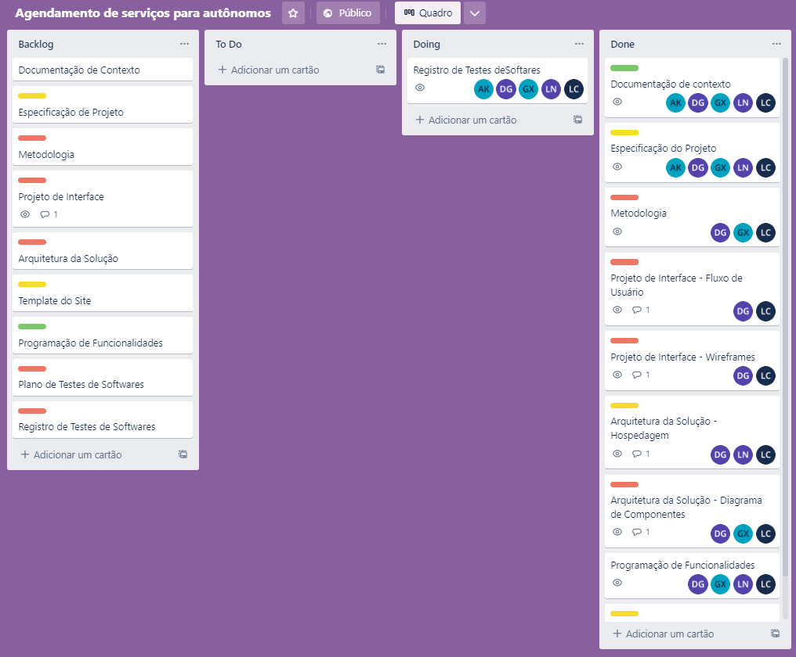

# Metodologia

A metodologia utilizada pelo grupo para que o problema apresentado pudesse ser solucionado foi o desenvolvimento de um aplicativo Web Front-End, utilizando da aplicação de processos ágeis e de feedbacks constantes do cliente para assegurar o aprimoramento do processo. Foram determinadas equipes auto-organizadas com a liderança diluída, tendo como facilitador do processo o Scrum Master. Utilizamos como artefatos o Backlog do Produto, Incremento do Protocolo e Backlog do Sprint. As ferramentas e estrutura para gestão do código fonte serão descritas a seguir.

## Relação de Ambientes de Trabalho

Os artefatos do projeto são desenvolvidos a partir de diversas plataformas e a relação dos 
ambientes com seu respectivo propósito é apresentada na tabela que se segue. 

|AMBIENTE | PLATAFORMA |LINK DE ACESSO |
|--------------------|------------------------------------|----------------------------------------|
| Repositório de código fonte |  GitHub | https://github.com/ICEI-PUC-Minas-PMV-ADS/pmv-ads-2022-2-e1-proj-web-t7-agendamento-de-servicos-para-autonomos |
| Documentação do projeto | GitHub | https://github.com/ICEI-PUC-Minas-PMV-ADS/pmv-ads-2022-2-e1-proj-web-t7-agendamento-de-servicos-para-autonomos |
| Projeto de Interface e Wireframes | Figma | https://figma.com/file/RLSUgRB2HktpcwRz6ldKnh/ADS?node-id=0%3A1 |
| Gerenciamento do Projeto | Trello | https://trello.com/b/rhN5TCrn/agendamento-de-servi%C3%A7os-para-aut%C3%B4nomos |

## Gerenciamento do Projeto

A equipe utiliza metodologias ágeis, tendo escolhido o Scrum como base para definição do 
processo de desenvolvimento.

A equipe está organizada da seguinte maneira:
- Product Owner: Íris Gabriela Queiroz Gonçalves
- Scrum Master: Luís Otávio Dos Santos Coura
- Equipe de Desenvolvimento: Douglas Zocrato Gomes, Gabriela Matos Xavier e Luiz Otávio Pereira Do Nascimento

## Processo

O processo foi definido através de sprints, onde ocorreu a definição do planejamento, execução e evidências.

### Sprint 1

- Planejamento:  Nesta sprint os entregáveis planejados foram a Documentação de Contexto e a Especificação do Projeto, sendo apresentadas a justificativa, objetivos, requisitos funcionais e não funcionais e as restrições. 
  
- Execução: 
  - Introdução: Íris Gabriela
  - Problema, Objetivos, Justificativa, Público Alvo, Personas: Luís Otávio e Gabriela Matos 
  - Histórias de usuários, Requisitos funcionais e não funcionais, Restrições: Adrian Keven, Douglas Zocaratto e Luiz Otávio 
  - A organização foi realizada principalmente pelo Whatsapp e tivemos como primeiros desafios a organização de horários e a investigação do estado da arte. 

- Evidências:

### Sprint 2

- Planejamento: Nesta sprint os entregáveis planejados foram a Metodologia, relacionando o ambiente de trabalho e o gerenciamento do projeto, também foi planejado fazer o Projeto de Interface, incluindo os fluxos de usuários e os Wireframes das diversas telas e a apresentação da Arquitetura de Solução.

- Execução:
  - Metodologia: Luís Otávio  
  - Projeto de Interface: Íris Gabriela 
  - Arquitetura de Solução: Douglas Zocaratto, Gabriela Mattos e Luiz Otávio  
  -  A partir desse momento foram definidas a utilização de plataformas como GitHub, Trello e Figma

- Evidências:

### Sprint 3

- Planejamento: Nesta sprint os entregáveis planejados foram o Template do Site e a Programação de Funcionalidades.

- Execução: 
  - Toda a equipe ficou responsável pela execução da sprint 
  - Foram apresentados o template em formato HTML e CSS e a Programação de Funcionalidades.

- Evidências:

### Sprint 4

- Planejamento:  Nesta sprint os entregáveis planejados foram o Plano de Testes de Softwares e os registros de Teste de Softwares.
  
- Execução: 
  - Toda a equipe ficou responsável pela execução da sprint 
  - Apesar da organização da equipe e da realização dos testes, não conseguimos implementar os registros de testes de Softwares.
  - Tivemos como dificuldades a inexperiência dos colaboradores com a manipulação dos objetos em JS e JSON, apesar do esforço executado não conseguimos nesse momento, em virtude do prazo e demanda indivídual da equipe de desenvolvimento, armazenar de maneira funcional o banco de dados. 

-Evidências

     

Para  organização  e  distribuição  das  tarefas  do  projeto,  a  equipe  está  utilizando  o Trello estruturado com as seguintes listas: 
  - Backlog: Recebe  as  tarefas  a  serem  trabalhadas  e  representa  o  Product  Backlog. Todas as atividades identificadas no decorrer do projeto também devem ser incorporadas a esta lista.
  - To  Do: Esta  lista  representa  o  Sprint  Backlog.  Este  é  o  Sprint  atual  que  estamos trabalhando.
  - Doing: Quando uma tarefa tiver sido iniciada, ela é movida para cá.
  - Done: Nesta lista são colocadas as tarefas que passaram pelos testes e controle de qualidade  e  estão  prontas  para  serem  entregues  ao  usuário.  Não  há  mais  edições  ou revisões necessárias, ele está agendado e pronto para a ação.

O quadro Kanban do grupo desenvolvido na ferramenta de gerenciamento de projetos está 
disponível através da URL (https://trello.com/b/rhN5TCrn/agendamento-de-servi%C3%A7os-para-aut%C3%B4nomos) e é apresentado, no estado atual, na Figura 10. 

Figura 1 - Tela do Kanban utilizada pelo grupo

