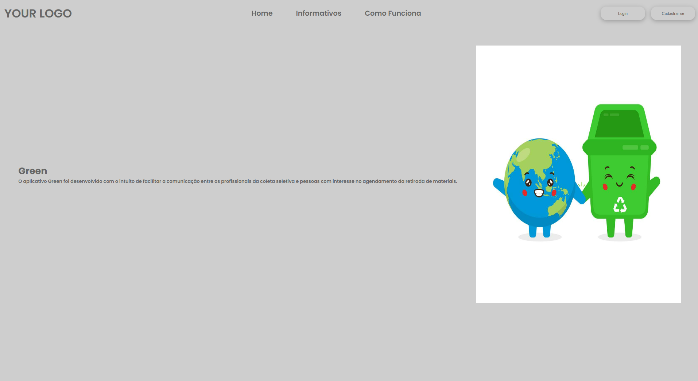

# Template padrão do site

O Layout padrão do site (HTML e CSS) será utilizado em todas as páginas com a definição de identidade visual e iconografia.

A responsividade segue o padrão do Bootstrap e o template está disponível no site https://icei-puc-minas-pmv-ads.github.io/pmv-ads-2022-2-e1-proj-web-t7-agendamento-de-servicos-para-autonomos/src/home.html

Figura 1: Pagina Inicial

Figura 2: Informativos

Figura 3: Como Funciona

Figura 4: Login

Figura 5: Seleção de Cadastro

Figura 6: Cadastro

