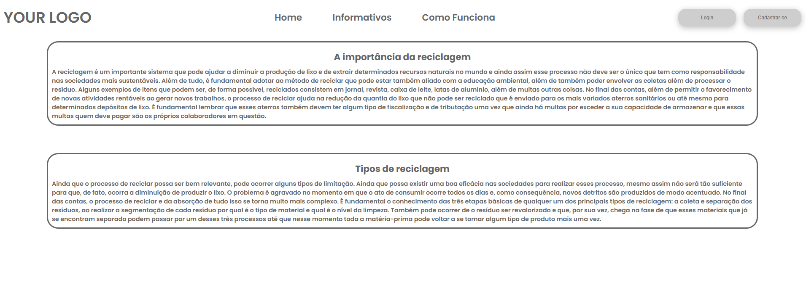
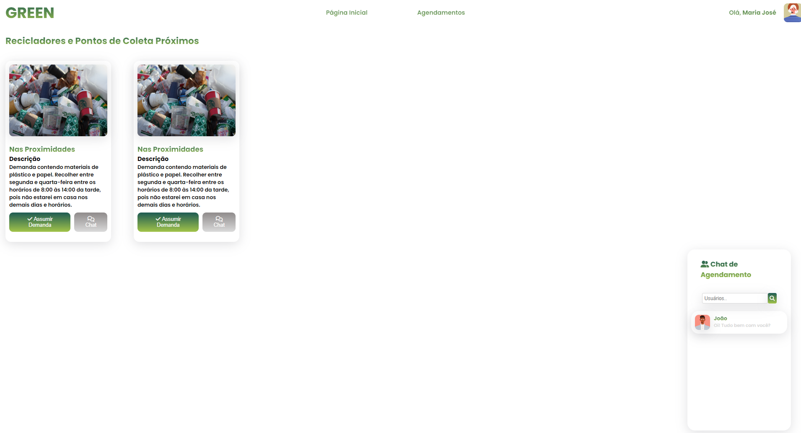
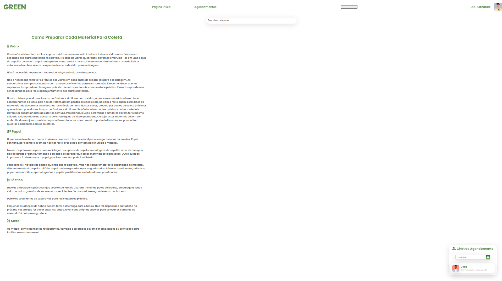
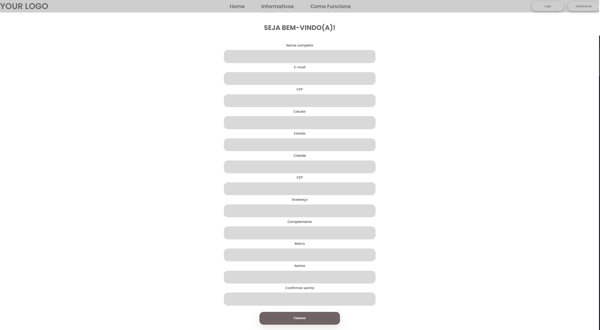
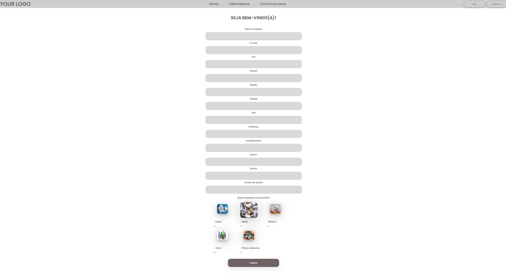

# Programação de Funcionalidades

# Informativos

Esta página contém informativos a respeito da relevância da reciclagem, bem como a variedade e padrões para o correto descarte dos resíduos sólidos.

<ins>**Requisitos atendidos**</ins>

* RF-002 - Ter informativos que dissertem a respeito dos impactos negativos do lixo no meio ambiente, bem como da importância da reciclagem

<ins>**Artefatos de funcionalidade**</ins>

* [Informativos](https://icei-puc-minas-pmv-ads.github.io/pmv-ads-2022-2-e1-proj-web-t7-agendamento-de-servicos-para-autonomos/src/informativos.html)
* estilo.css

<ins>**instruções de acesso**</ins>
 1. Abra o navegador de internet e informe o seguinte URL: https://icei-puc-minas-pmv-ads.github.io/pmv-ads-2022-2-e1-proj-web-t7-agendamento-de-servicos-para-autonomos/src/home.html
  2. Clique na aba Informativos
--------------------------
# Home Catador

Esta página é apresentada após o coletador ter realizado login, o mesmo poderá visualizar e assumir a demanda, e também entrar em contato com o reciclador via chat.

<ins>**Requisitos atendidos**</ins>

* RF-005 - Possibilitar que os coletadores encontrem os recicladores e os pontos de pontos de entrega mais próximos

<ins>**Artefatos de funcionalidade**</ins>

* [Home Coletador](https://icei-puc-minas-pmv-ads.github.io/pmv-ads-2022-2-e1-proj-web-t7-agendamento-de-servicos-para-autonomos/src/CatadorHome.html)
* estilo.css

<ins>**instruções de acesso**</ins>
1. Abra o navegador de internet e informe o seguinte URL: https://icei-puc-minas-pmv-ads.github.io/pmv-ads-2022-2-e1-proj-web-t7-agendamento-de-servicos-para-autonomos/src/CatadorHome.html
2. Clique sobre o Card para identificar a localização da demanda
3. Clique em assumir demanda para manifestar aceitação ao serviço oferecido
4. Clique em chat para entrar em contato com o Recilador
--------------------------------
# Home Reciclador

Esta pagina é apresentada após o Reciclador ter realizado login, o mesmo terá acesso a notícias sobre os tipos de residuos, formas de preparação e manuseio, e também entrar em contato com o coletador via chat.

<ins>**Requisitos atendidos**</ins>

* RF-001 - Permitir agendar a coleta e informar aos usuários como preparar os materiais para a retirada
* RF-004 - Permitir que o reciclador combine os detalhes da retirada com o coletador

<ins>**Artefatos de funcionalidade**</ins>

* [Home Recilador](https://icei-puc-minas-pmv-ads.github.io/pmv-ads-2022-2-e1-proj-web-t7-agendamento-de-servicos-para-autonomos/src/HomeReciclador.html)
* estilo.css

<ins>**instruções de acesso**</ins>
1. Abra o navegador de internet e informe o seguinte URL: https://icei-puc-minas-pmv-ads.github.io/pmv-ads-2022-2-e1-proj-web-t7-agendamento-de-servicos-para-autonomos/src/HomeReciclador.html
2. Leia atentamente as orientações para acondicionamento e manuseio do material escolhido para descarte
3. Clique na aba Agendamentos para registrar a demanda de materiais a serem reciclados
4. Após confirmado o interesse por parte de um coletador para o serviço ofertado, combine os detalhes de retirada através do chat disponível na margem esquerda da página
----------------------------
# Cadastre-se

Esta página permite ao usuário que identifique-se como coletador ou reciclador, em seguida é direcionado para as páginas que permitem o registro de sua localização, dados pessoais e realizar o cadastramento de senha de sua preferência.

<ins>**Requisitos atendidos**</ins>

* RF-003 - 	Possibilitar o cadastro de recicladores, coletadores e pontos de entrega

# Artefatos de Funcionalidades

* [Cadastre-se](https://icei-puc-minas-pmv-ads.github.io/pmv-ads-2022-2-e1-proj-web-t7-agendamento-de-servicos-para-autonomos/src/cadastro.html)
* [Cadastro de Recilador](https://icei-puc-minas-pmv-ads.github.io/pmv-ads-2022-2-e1-proj-web-t7-agendamento-de-servicos-para-autonomos/src/cadastrocatador.html)
* [Cadastro de Coletador](https://icei-puc-minas-pmv-ads.github.io/pmv-ads-2022-2-e1-proj-web-t7-agendamento-de-servicos-para-autonomos/src/cadastroreciclador.html)
* estilo.css

<ins>**instruções de acesso**</ins>
1. Abra o navegador de internet e informe o seguinte URL: https://icei-puc-minas-pmv-ads.github.io/pmv-ads-2022-2-e1-proj-web-t7-agendamento-de-servicos-para-autonomos/src/cadastro.html
2. Identifique-se como Coletador ou Reciclador
3. Caso seja Reciclador, registre as informações solicitadas referente a dodos pessoais, localização, contato, realize o cadastramento e confirmação da senha desejada. 
4. Caso seja Coletador, registre as informações solicitadas referente a dodos pessoais, localização, contato, realize o cadastramento e confirmação da senha desejada, informe qual o tipo de material realiza o recolhimento.
