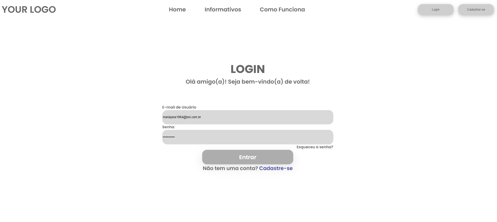
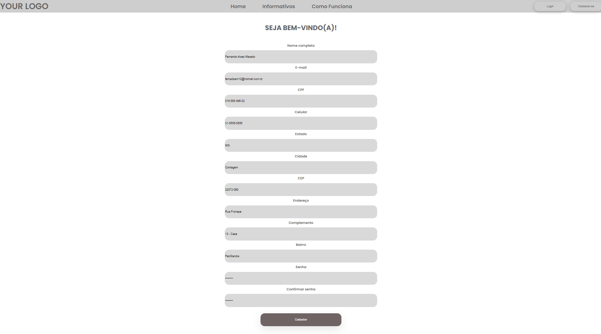
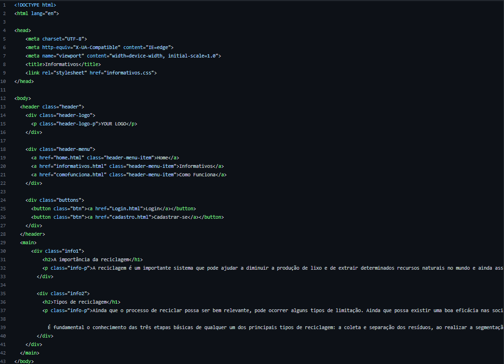
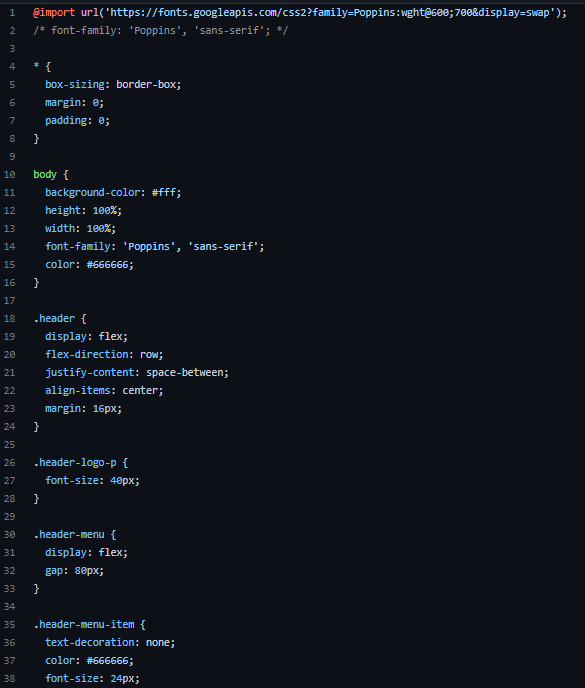

# Programação de Funcionalidades

A pagina de login apresenta dados de usuários que foram cadastrados, os usuários e senhas são armazenados no LocalStorgage com estruturas de dados baseadas em JSON.
Um exemplo da tela é apresentada a seguir:

## Possibilitar o cadastro de recicladores, coletadores e pontos de entrega (RF-004)

A pagina Cadastre-se apresenta para cadastramentos dados de usuários, e-mail, localização, telefone e senha, que são armazenados no LocalStorgage com estruturas de dados baseadas em JSON.
Um exemplo da tela é apresentada a seguir:

<ins>**Requisitos atendidos**</ins>
  - RF-004

<ins>**Artefatos de funcionalidade**</ins>
  - cadastrorecilador.hmtl
  - script_home.js
  - cadastroreciclador.css
  - cadastroreciclador-pf.png

<ins>**Estrutura de Dados**</ins>
  
Em desenvolvimento

<ins>**instruções de acesso**</ins>
  - Abra o navegador de internet e informe o seguinte URL: https://icei-puc-minas-pmv-ads.github.io/pmv-ads-2022-2-e1-proj-web-t7-agendamento-de-servicos-para-autonomos/src/home.html
  - Clique na aba Cadastre-se
  - Identifique-se como Coletador ou Reciclador
  - Insira os dados: Nome Completo, e-mail, CPF, Celular, Estado, CEP, Endereço, Complemento, Bairro, Senha, Confirma senha, e depois clique em cadastrar

## Ter informativos que dissertem a respeito dos impactos negativos do lixo no meio ambiente, bem como da importância da reciclagem (RF-003)

A pagina Informativos apresenta informações essenciais aos usuários a respeito da importância da reciclagem e metodos de manuseio de matériais recicláveis. A mesma possui estrutura de dados baseada em HTML e CSS.
Um exemplo da tela é apresentada a seguir:

<ins>**Requisitos atendidos**</ins>
  - RF-003

<ins>**Artefatos de funcionalidade**</ins>
  - informativos.hmtl
  - informativos.css

<ins>**Estrutura de Dados**</ins>

<ins>**instruções de acesso**</ins>
  - Abra o navegador de internet e informe o seguinte URL: https://icei-puc-minas-pmv-ads.github.io/pmv-ads-2022-2-e1-proj-web-t7-agendamento-de-servicos-para-autonomos/src/home.html
  - Clique na aba Informativos
