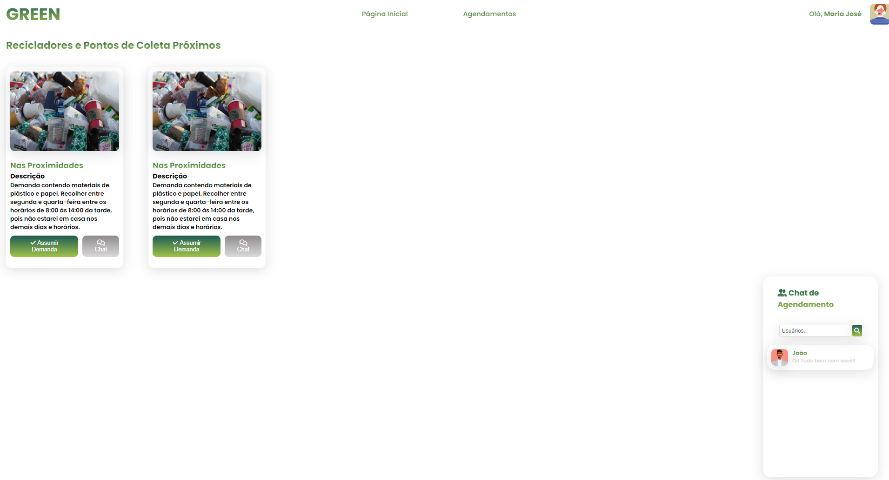
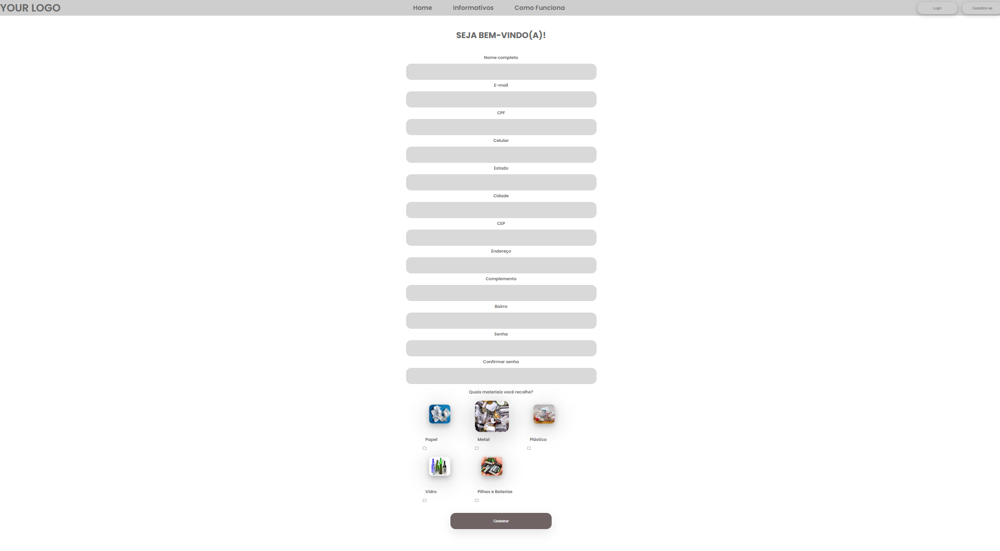

# Registro de Testes de Software

Os resultados obtidos nos testes de software realizados são descritos abaixo.

## CT-01 - Visualizar agendamento da coleta para Recicladores

A página foi apresentada corretamente conforme o plano de teste proposto. É possível verificar que o teste obteve sucesso de acordo com a figura abaixo.

## CT-02 - Visualizar agendamento da coleta para Coletadores

A página foi apresentada corretamente conforme o plano de teste proposto. É possível verificar que o teste obteve sucesso de acordo com a figura abaixo.

## CT-03 - Acesso a Tela de Login

Após acessar a página Login, a mesma foi apresentada corretamente conforme o plano de teste proposto. É possível verificar que o teste obteve sucesso de acordo com a figura abaixo.

## CT-04 - Visualizar o cadastramento de Recicladores

Após acessar a página Cadastre-se, a mesma foi apresentada corretamente conforme o plano de teste proposto. É possível verificar que o teste obteve sucesso de acordo com a figura abaixo.

## CT-05 - Visualizar o cadastramento de Coletadores

Após acessar a página Cadastre-se, a mesma foi apresentada corretamente conforme o plano de teste proposto. É possível verificar que o teste obteve sucesso de acordo com a figura abaixo.

## CT-05 - Visualizar o cadastramento de Coletadores

Após acessar a página Informativos, a mesma foi apresentada corretamente conforme o plano de teste proposto. É possível verificar que o teste obteve sucesso de acordo com a figura abaixo.

